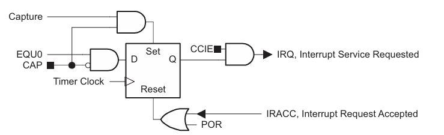

# Clock Unit

comprised of fast master clock (MCLK) + slower auxiliary clock (ACLK)

MCLK used by cpu

Mux into timer to select between main and slow clock

# Timer

Registers:
TxCTR   : 8b: Control Register 
TxCR    :16b: Compare Register

TxCTR = |     1b     |     1b     |                3b                   |     1b     |     1b     |     1b     |
        | CLK select |Timer Enable|              Divider                |    Clear   |  Intr Enb  |    Intr    |

CLK select: Clock source selection
    0: MCLK select
    1: ACLK select

Timer Enable: Enables/disables the timer
    0: Timer Halt   : stops timer
    1: Timer Start  : starts timer repeatedly counts down to from 0xFFFF to TxCR 

Divider: divide source clock frequency
    000: /1          
    001: /2          
    010: /4          
    011: /8          
    100: /16
    101: /32
    110: /64
    111: /128

Clear: reset timer state
    1: clear        : clears counter, clock divider count

Intr Enb: enable interrupts
    0: interrupt disabled 
    1: interrupt enabled

Intr: interrupt flag
    0: no interrupt pending
    1: inturrpt pending

Interupt Code: 00

Interupts triggered on high state

